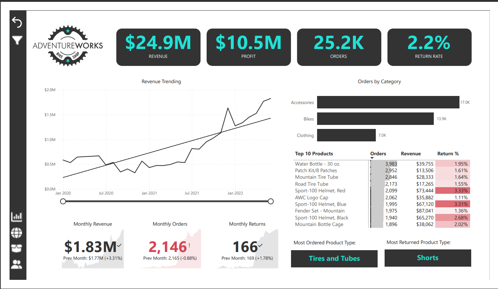

A project-based power BI course that provides a complete discussion from data preparation using power query, data modeling, to creating complete and complex reports.

# Goals
- Track Key Performance Indicators (KPIs)
- Compare regional performance
- Analyze product-level trends
- Identify high-value customers

# Data Used
- Dataset - 10 datasets which contain information about       transactions, returns, products, costumers, and sales territories.
- Data Preparation, Data Visualization - Microsoft Power BI

# Findings

- In June 2022, the company generated USD 24.9 million in revenue, with a profit of USD 10.5 million, 25,200 orders, and a return rate of 2.2%.
- The United States has the highest number of orders compared to other countries, totaling 8,700 orders. Australia comes in second with 6,060 orders.
- The most ordered product was in Tires and Tubes category, while the most returned was in Short category.
- Mr. Maurice Shan was a top customer with a total of 6 orders. Total revenue generated from Mr. Maurice Shan alone was USD 12,400.
